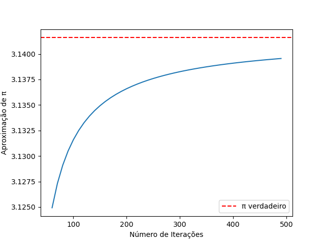
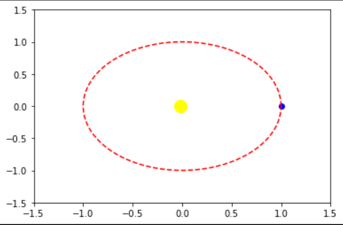

# Trabalhos feitos em Python

Bem-vindo ao meu repositório! Aqui você encontrará diferentes projetos e desafios que trabalhei em Python.

## Desafios  🎯

- Os desafios são exercícios práticos para melhorar minhas habilidades em Python.

- Você pode acessar os desafios clicando aqui: [Explore os Desafios](Desafios)

## Cálculos computacionais 🔢

- Aproximações numéricas são métodos usados para resolver problemas matemáticos complexos de forma iterativa.

- Acesse a pasta de cáclulos computacionais clicando aqui: [Cálculos computacionais](Cálculos_numerico)

## Simulações 🌐

- Simulações são usadas para modelar fenômenos reais e observar seu comportamento sob diferentes condições.

- Acesse a pasta de cáclulos computacionais clicando aqui: [Explore as Simulações](Simulações)
