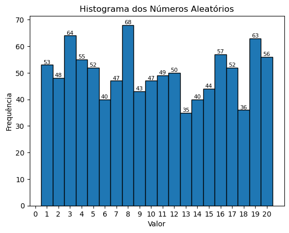
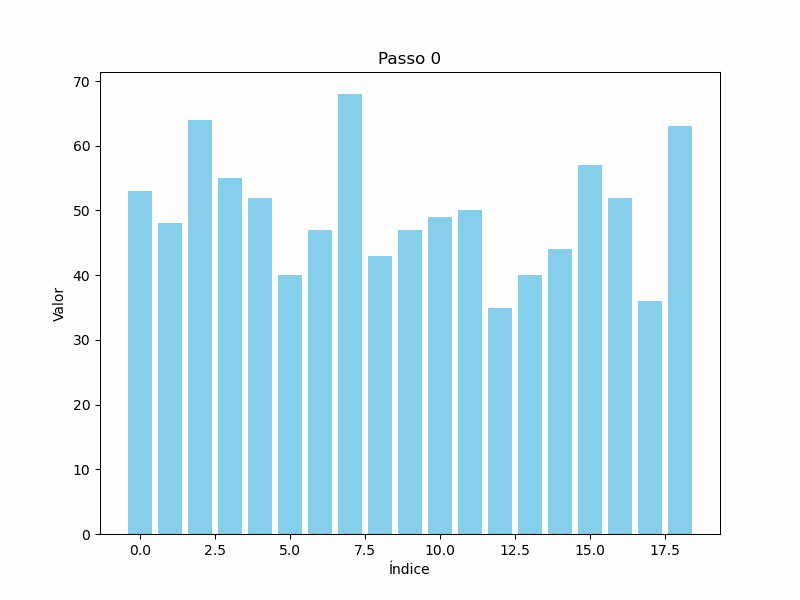

# Bubble Sort 🎉

**Feito por: Gabriel_S**  
  
 

---

## O que é o Bubble Sort? 🧠💡

O **Bubble Sort** é um dos algoritmos de ordenação mais simples! Ele compara dois elementos consecutivos de uma lista e troca eles de lugar se estiverem na ordem errada. 🧐 Isso é repetido várias vezes até que todos os elementos estejam na ordem correta. 🏆✨

Eu criei um algoritmo para demonstrar o funcionamento do Bubble Sort e, além disso, gerei um gráfico para ilustrar cada passo da ordenação visualmente. 📊

---

### Passo a passo 🔍🔢

1. Compare o primeiro e o segundo elemento.
2. Se o primeiro for maior que o segundo, troque eles! 🔄
3. Continue comparando os próximos pares até o final da lista. 📏
4. Repita o processo para todas as posições até que a lista esteja ordenada! ✔️

---

### Gráficos do Bubble Sort 📊✨

#### Antes da ordenação:

Este gráfico mostra a lista inicial, com os elementos fora de ordem. Cada barra representa um valor, e o algoritmo começa comparando e trocando os elementos conforme necessário.

---

### Veja a animação do Bubble Sort em ação! 🎬🔄

---
